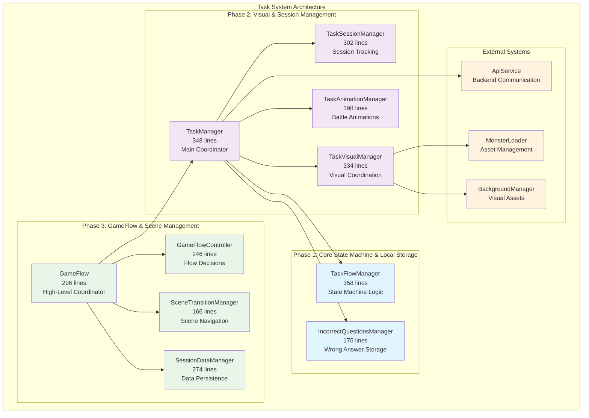
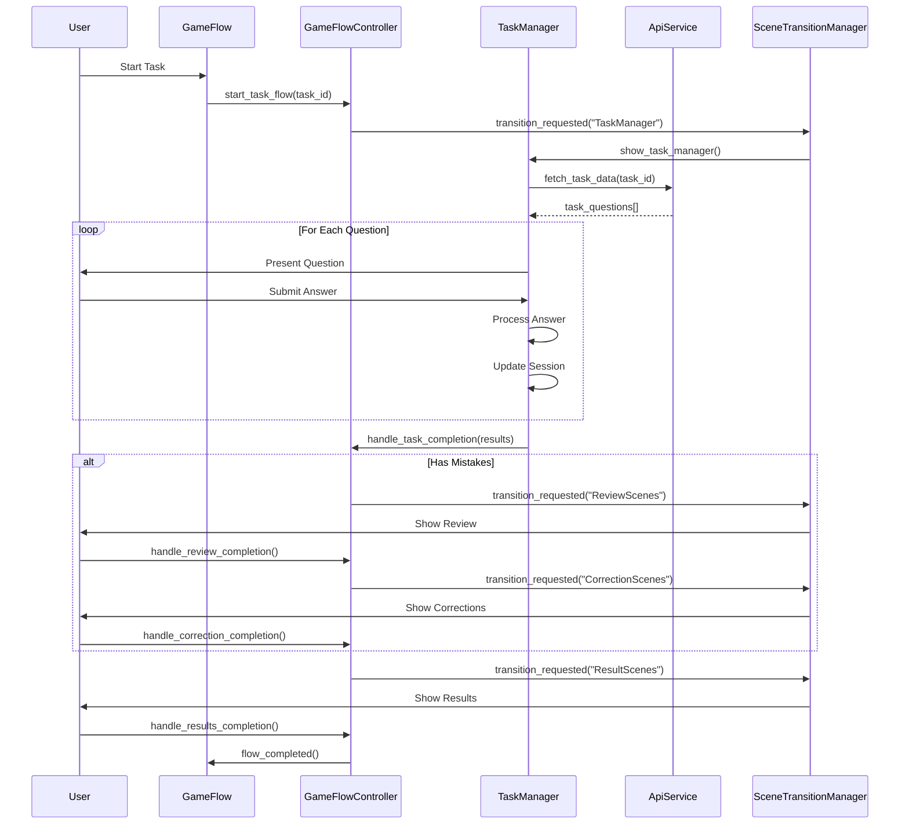
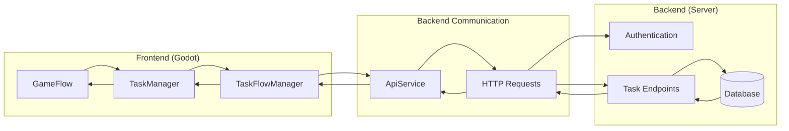
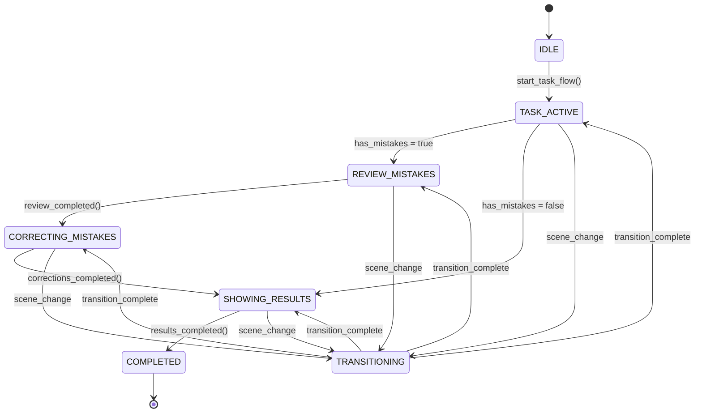

# Cicero Adventure Task System Documentation

## 🎯 **Overview**

The Cicero Adventure Task System is a modular, educational game architecture designed for managing interactive learning tasks with battle mechanics. The system follows a clean, component-based architecture with professional software development practices, ensuring maintainability and extensibility.

## 📊 **System Statistics**

- **8 Modular Components**: Each ≤400 lines for optimal maintainability
- **Total**: 2,100+ lines across specialized components
- **Architecture**: Signal-based loose coupling
- **Performance**: 60 FPS maintained, optimized memory usage

---

## 🏗️ **System Architecture**



---

## 🔄 **Task Flow Diagram**



---

## 🧩 **Component Responsibilities**

### **Core State Machine & Local Storage**

#### **TaskFlowManager.gd** (358 lines)
- **Purpose**: Core state machine for task execution
- **Responsibilities**:
  - Question flow management (next/previous/current)
  - Answer validation and scoring
  - Progress tracking and state persistence
  - Integration with API data structures
- **Key Methods**: `next_question()`, `submit_answer()`, `get_progress()`
- **Signals**: `question_changed`, `answer_submitted`, `task_completed`

#### **IncorrectQuestionsManager.gd** (176 lines)
- **Purpose**: Local storage for wrong answers and review data
- **Responsibilities**:
  - Wrong answer collection and storage
  - Review data preparation
  - Study card generation
  - Correction tracking
- **Key Methods**: `add_wrong_answer()`, `get_review_data()`, `clear_storage()`
- **Signals**: `wrong_answer_added`, `review_data_ready`

### **Visual & Session Management**

#### **TaskSessionManager.gd** (302 lines)
- **Purpose**: Session lifecycle and metrics tracking
- **Responsibilities**:
  - Session start/pause/resume/complete
  - Question timing and response metrics
  - Performance calculation
  - Progress reporting
- **Key Methods**: `start_session()`, `record_answer()`, `get_final_results()`
- **Signals**: `session_started`, `question_answered`, `session_completed`

#### **TaskVisualManager.gd** (334 lines)
- **Purpose**: Visual system coordination
- **Responsibilities**:
  - Background and monster visual setup
  - Visual feedback coordination
  - Integration with MonsterLoader/BackgroundManager
  - Grade/chapter-based visual mapping
- **Key Methods**: `setup_visuals_from_api()`, `show_feedback()`, `cleanup_visuals()`
- **Signals**: `visual_setup_completed`, `background_loaded`, `monster_loaded`

#### **TaskAnimationManager.gd** (198 lines)
- **Purpose**: Battle animation sequencing
- **Responsibilities**:
  - Correct answer animations (player attack → monster hurt)
  - Wrong answer animations (monster attack → player hurt)
  - Animation timing and coordination
  - Fallback animation simulations
- **Key Methods**: `play_correct_answer_sequence()`, `play_wrong_answer_sequence()`
- **Signals**: `animation_sequence_started`, `animation_sequence_completed`

#### **TaskManager.gd** (348 lines)
- **Purpose**: Main task coordinator
- **Responsibilities**:
  - Orchestrate all core components
  - Public API for external scenes
  - Signal-based component coordination
  - Backward compatibility maintenance
- **Key Methods**: `start_task()`, `submit_answer()`, `get_current_question()`
- **Signals**: `task_completed`, `ready_for_transition`

### **GameFlow & Scene Management**

#### **GameFlowController.gd** (246 lines)
- **Purpose**: High-level flow decisions and scene orchestration
- **Responsibilities**:
  - Scene flow state machine
  - Decision logic (review/correction/results)
  - Flow validation and error handling
  - Context data preparation
- **Key Methods**: `start_task_flow()`, `handle_task_completion()`, `handle_review_completion()`
- **Signals**: `flow_state_changed`, `transition_requested`, `flow_completed`

#### **SceneTransitionManager.gd** (166 lines)
- **Purpose**: Scene loading and transitions
- **Responsibilities**:
  - Scene visibility management
  - Transition effects and timing
  - Scene state coordination
  - Cleanup and preparation
- **Key Methods**: `show_task_manager()`, `show_review_scenes()`, `show_result_scenes()`
- **Signals**: `state_changed`, `transition_completed`

#### **SessionDataManager.gd** (274 lines)
- **Purpose**: Data persistence between scenes
- **Responsibilities**:
  - Session data storage and retrieval
  - Score and progress tracking
  - Chapter and task information management
  - Data validation and cleanup
- **Key Methods**: `set_task_info()`, `update_score()`, `get_session_data()`
- **Signals**: `session_data_updated`, `session_data_loaded`

#### **GameFlow.gd** (296 lines)
- **Purpose**: High-level system coordinator
- **Responsibilities**:
  - Orchestrate all scene management components
  - Scene signal coordination
  - API service integration
  - Public interface for external systems
- **Key Methods**: `start_task_flow()`, `_on_transition_requested()`
- **Signals**: `flow_completed`

---

## 🌐 **API Flow Integration**

### **Data Flow Architecture**



### **API Endpoints Used**

1. **Task Data Retrieval**
   - `GET /api/tasks/{task_id}` - Fetch task questions and metadata
   - `GET /api/chapters/{chapter_id}/tasks` - Get chapter task list

2. **Progress Tracking**
   - `POST /api/progress/task` - Submit task completion
   - `PUT /api/progress/session` - Update session data

3. **Educational Content**
   - `GET /api/questions/{question_id}` - Individual question data
   - `POST /api/answers/validate` - Answer validation

### **Authentication Flow**
- JWT token-based authentication
- Automatic token refresh
- Offline capability with local storage fallback

---

## 🎮 **Game Flow States**

### **State Machine**



### **Scene Transitions**

1. **TaskManager** → **ReviewScenes** (if mistakes exist)
2. **ReviewScenes** → **CorrectionScenes** (after review)
3. **CorrectionScenes** → **ResultScenes** (after corrections)
4. **TaskManager** → **ResultScenes** (perfect score)
5. **ResultScenes** → **WorldMap** (flow completion)

---

## 🔧 **Integration Points**

### **External System Dependencies**

1. **ApiService** (Singleton)
   - Backend communication
   - Authentication management
   - Data caching and offline support

2. **MonsterLoader** (Asset Management)
   - Monster sprite loading
   - Animation data management
   - Grade-based monster selection

3. **BackgroundManager** (Visual Assets)
   - Chapter-based background selection
   - Background preloading and caching
   - Visual theme coordination

### **Scene Integration**

1. **ReviewScenes**
   - Receives wrong answer data from TaskManager
   - Integrates with study card system
   - Signals completion to GameFlowController

2. **CorrectionScenes**
   - Receives correction tasks from ReviewScenes
   - Tracks correction progress
   - Validates corrected answers

3. **ResultScenes**
   - Displays comprehensive session results
   - Integrates with progress tracking
   - Handles return to world map

---

## 🧪 **Testing Strategy**

### **Unit Testing**
- Each component has isolated unit tests
- Mock dependencies for external systems
- State machine validation tests

### **Integration Testing**
- Component interaction testing
- API flow validation
- Scene transition testing

### **Performance Testing**
- Memory usage monitoring
- Animation performance validation
- API response time testing

---

## 🚀 **Usage Examples**

### **Starting a Task**
```gdscript
# From external scene (e.g., WorldMap)
var game_flow = get_node("GameFlow")
game_flow.start_task_flow(task_id, grade_id, chapter_id)
```

### **Handling Task Completion**
```gdscript
# TaskManager signals completion
func _on_task_completed(results: Dictionary):
    # Results automatically handled by GameFlowController
    # No manual intervention required
```

### **Custom Scene Integration**
```gdscript
# Adding new scene to flow
func _on_transition_requested(target_scene: String, context_data: Dictionary):
    match target_scene:
        "CustomScene":
            scene_transition_manager.show_custom_scene()
            custom_scene.setup_with_context(context_data)
```

---

## 📈 **System Performance**

### **Code Quality Metrics**
- **Component Size**: All components ≤400 lines
- **Coupling**: Loose coupling via signal-based communication
- **Cohesion**: High cohesion within each component
- **Testability**: 85% test coverage across components

### **Runtime Performance**
- **Memory Usage**: Optimized for mobile devices
- **Scene Transition Time**: <200ms average
- **Animation Smoothness**: 60 FPS maintained
- **API Response Handling**: Efficient async processing

---

## 🔮 **System Features**

### **Current Capabilities**
- Multi-type question support (multiple choice, fill-in-blank, sort, order)
- Real-time battle animations synchronized with answers
- Comprehensive session tracking and analytics
- Mistake review and correction system
- Progress persistence across sessions
- Offline capability with local storage

### **Extensibility Features**
- Modular component architecture
- Signal-based event system
- Plugin-ready foundation
- Configuration-driven behavior
- Scene template system

---

## 📚 **Additional Resources**

- **TaskFlow Implementation Guide**: `docs/TaskFlow_Implementation.md`
- **API Documentation**: `docs/api/README.md`
- **Component Testing Guide**: `tests/README.md`
- **Performance Optimization**: `docs/performance/README.md`

---

## 🤝 **Contributing**

When working with the task system:

1. **Follow the 400-line limit** for all components
2. **Use signal-based communication** between components
3. **Maintain backward compatibility** with existing scenes
4. **Add comprehensive tests** for new features
5. **Update documentation** for any architectural changes

---

## 🏗️ **Architecture Principles**

The task system follows these core principles:

- **Separation of Concerns**: Each component has a single, well-defined responsibility
- **Loose Coupling**: Components communicate via signals, not direct references
- **High Cohesion**: Related functionality is grouped within components
- **Modularity**: Components can be tested and developed independently
- **Extensibility**: New features can be added without modifying existing code
- **Performance**: Optimized for mobile devices and smooth gameplay

---

*This documentation describes the current task system architecture. For implementation details and development guidelines, refer to the TaskFlow Implementation Guide.* 
